# Welcome to my Git CM 2026 page!

## Column {width=40%}

### Row {height=60%}

::: {.card}
The github for Computation Musicology

This repository contains the code and resources for the Computation Musicology course (CM_2026). The course covers various topics in computational musicology, including music analysis, music information retrieval, and machine learning applications in music.

The corpus is based on my 'Your Top 100' playlists from the last 8 years, for which I will try to answer the following questions:
```{text}
1. What are the most common musical features across my top songs?
2. How do these features evolve over time in my listening habits?
3. Did my tastes change over the years, and if so, how?
```
For this and last week, I chose two of my favorite songs from my corpus, which are also among the most popular songs in my playlists: "Brain Damage" by Pink Floyd and "Breathe (In the Air)" by Pink Floyd. I will compare the chroma and timbre self-similarity matrices for both songs, as well as the key and chord analyses, to explore their structural and harmonic characteristics.
:::

## Column {width=40%}

### Row {height=60%}

::: {.panel-tabset .card}

## Week 9
::: {layout="[[1,1],[1,1]]"}
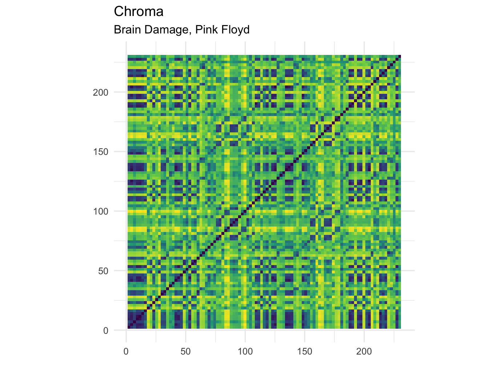
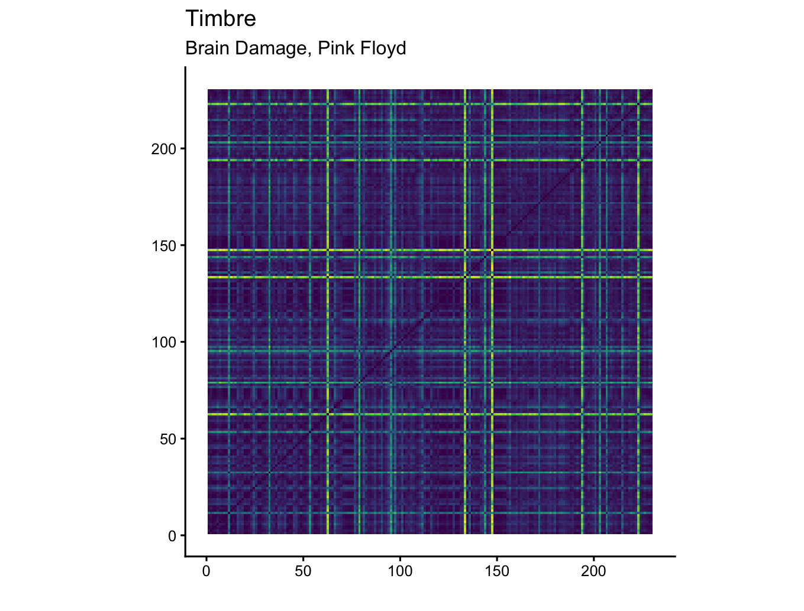

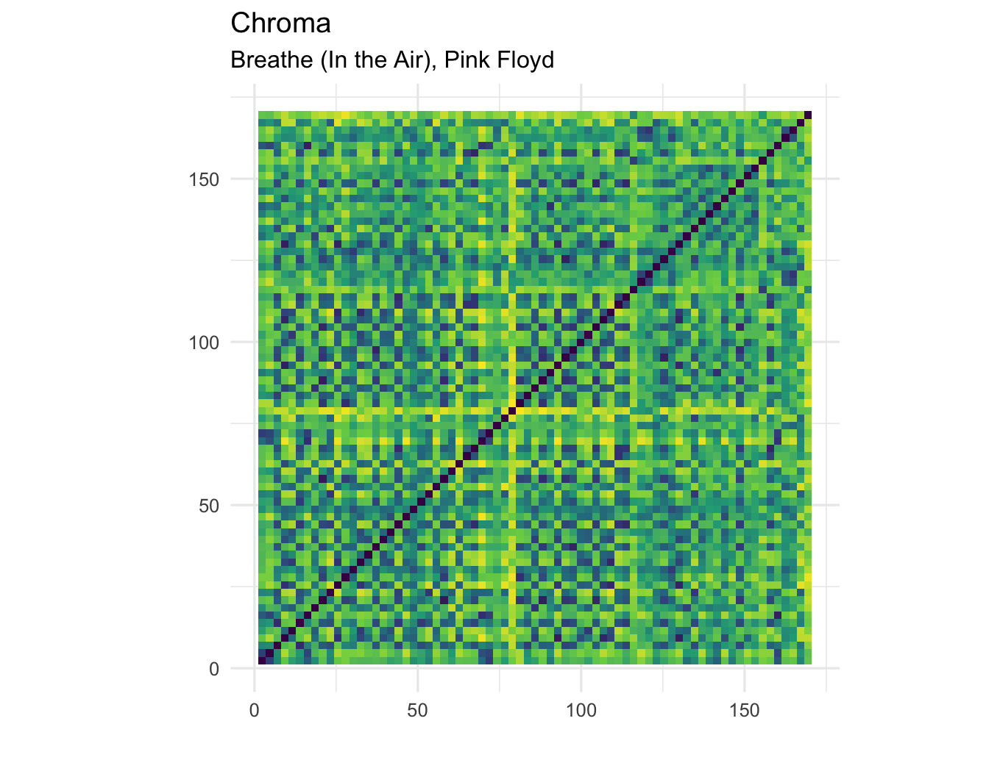
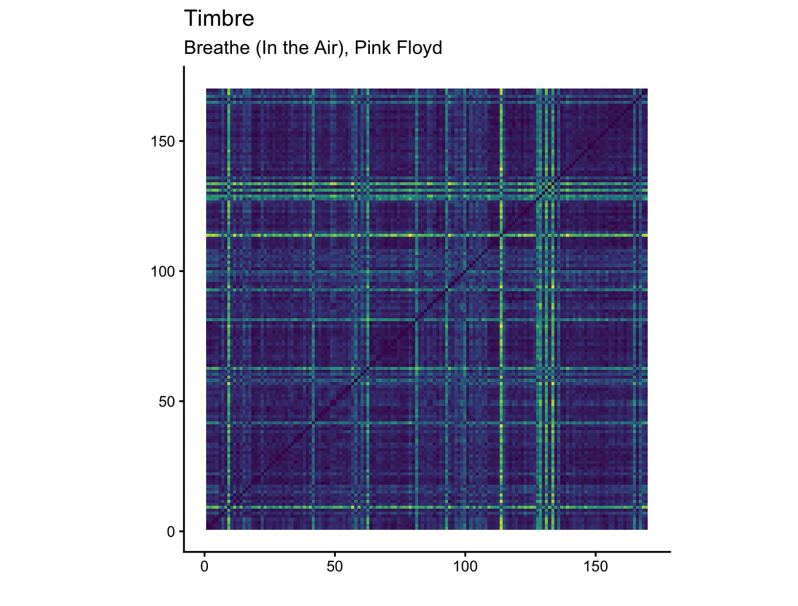
:::
The chroma self-similarity matrices reveal recurring harmonic material in both songs, but Brain Damage shows a denser and more varied pattern than Breathe (In the Air), suggesting greater local harmonic contrast. The timbre self-similarity matrices show clearer sectional boundaries in both songs, indicating that changes in texture and production help define form more strongly than harmony alone. Overall, Breathe appears more smooth and structurally regular, while Brain Damage appears more segmented and internally varied. 

## Week 10
::: {layout="[[1,1],[1,1]]"}
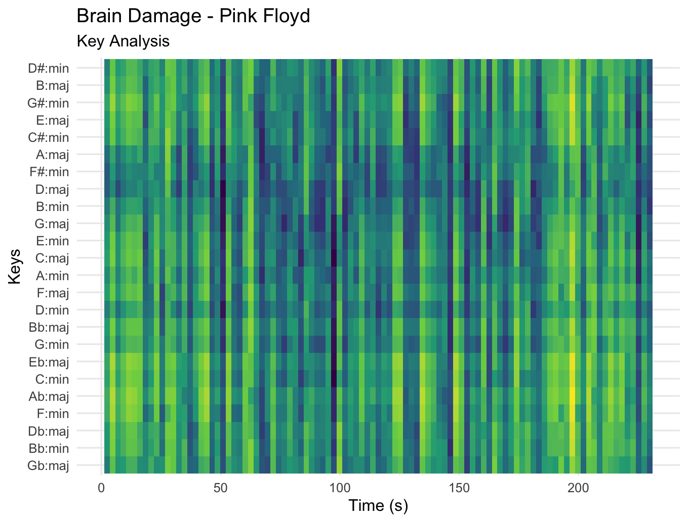{width=100%}
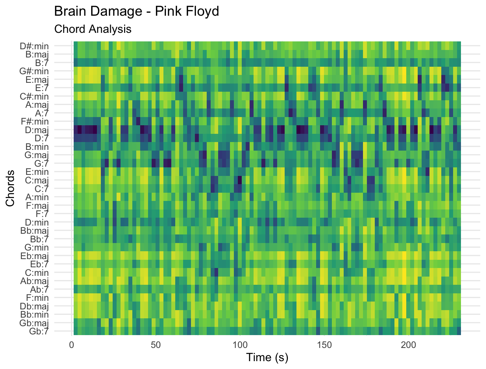{width=100%}

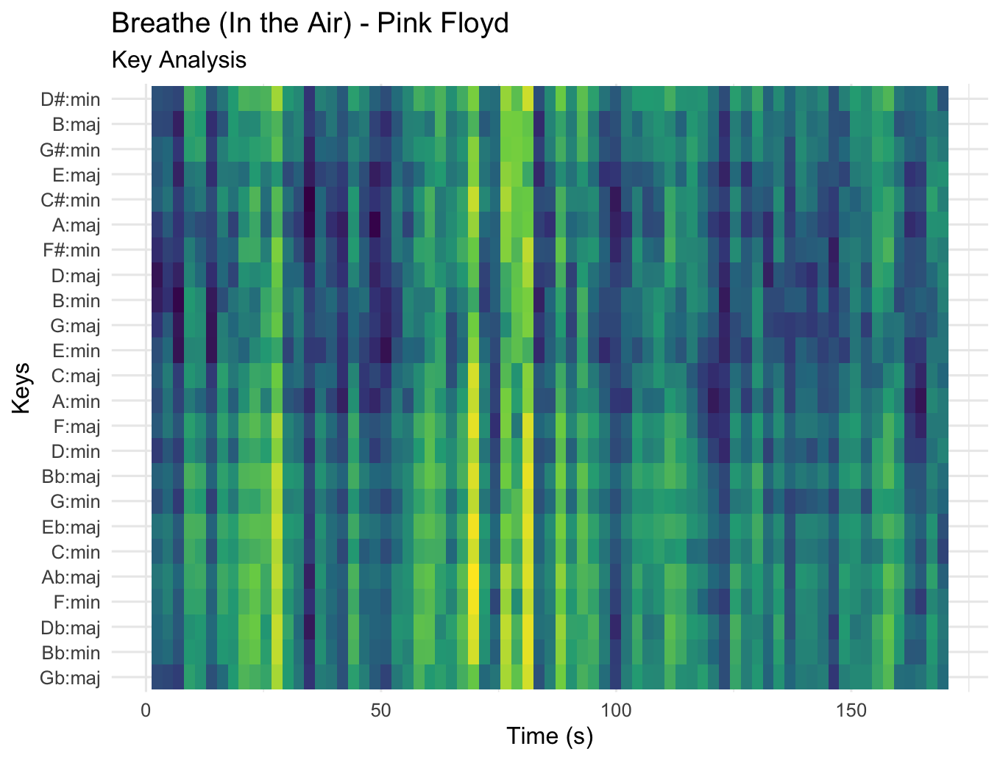{width=100%}
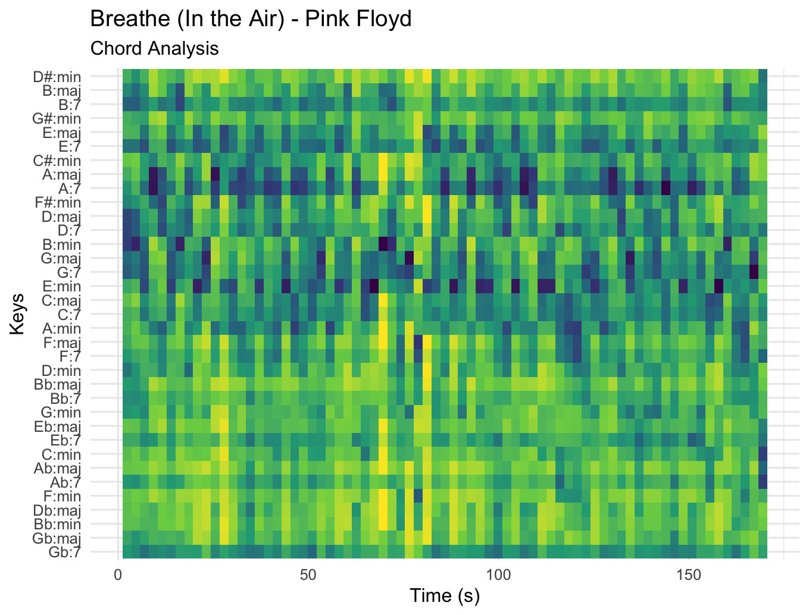{width=100%}
:::
The key analysis heatmaps are smoother and more stable than the chord analysis heatmaps for both songs, indicating that tonal centre is more constant over time than local chord content. Brain Damage shows a relatively stable tonal framework but a more varied chord profile, suggesting greater local harmonic movement within an overall coherent key area. In contrast, Breathe (In the Air) appears more harmonically uniform, with both the key and chord analyses showing more sustained and repetitive patterns. Overall, the comparison suggests that Breathe is tonally and harmonically more consistent, while Brain Damage contains more local harmonic contrast.

## Week 11

::: {.panel-tabset .card}
## Novelty

### {height=60%}

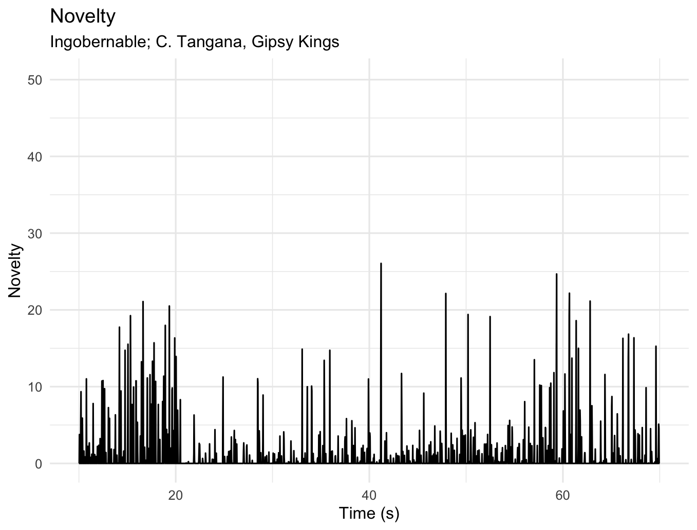{width=100%}

## Autocorrelation

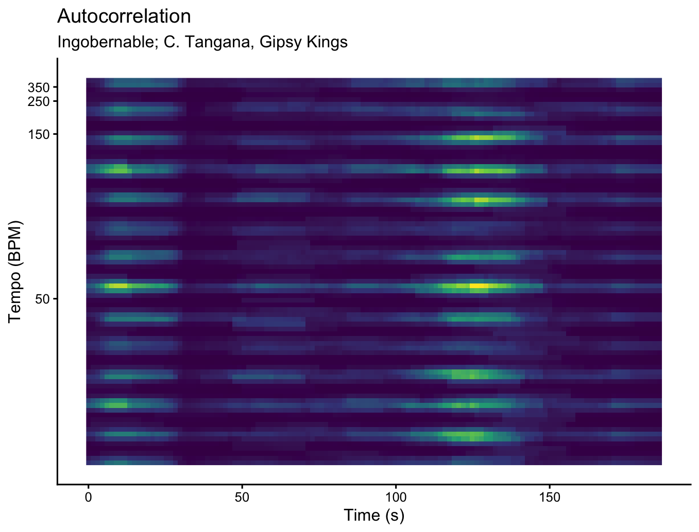{width=100%}

## Fourier

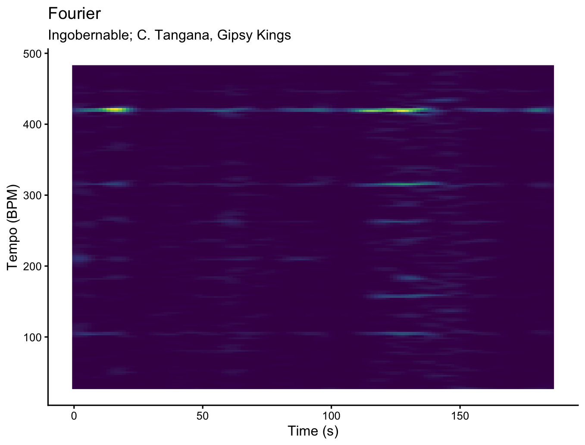{width=100%}
:::

### {height=40%}
Ingobernable is a song is a song I listened to when I was in Seville and is also in my corpus. It is inspired by the flamenco style, which is known for its complex rhythms and energetic grooves. The novelty curve and tempograms for this song reveal a lot about its rhythmic structure and how it creates a sense of drive and momentum. 
Because Ingobernable has a strong flamenco-influenced sound, the figures show exactly the kind of rhythmic richness you would expect from a song with sharp accents, guitar-driven energy, and a lot of internal motion in the groove. In the novelty curve, this is visible as many clear peaks, which suggests that the song has frequent and pronounced note attacks rather than a soft or blurred pulse. In the tempograms, both methods capture that pulse quite well, but they show it in slightly different ways: the autocorrelation tempogram contains several horizontal bands at different tempo levels, which makes the rhythm look layered and gives the impression that multiple metrical interpretations are active at once, while the Fourier tempogram looks cleaner and more focused, with the strongest bands standing out more clearly. What is most visible in the images is that there are several related tempo bands stacked above one another, which points more toward tempo harmonics than sub-harmonics, and that fits the musical character of the song, because a flamenco-based groove often emphasizes not only the main beat but also its faster subdivisions. Together, the images suggest that Ingobernable is rhythmically strong, energetic, and full of drive, and that its pulse is clear enough for both analyses to detect, with the Fourier tempogram giving the sharpest picture of that structure.

:::


