# Background and dataset

## Column {width=45%}

::: {.card}
### Project overview

This dashboard presents a computational musicological analysis of my own top songs from **2018 to 2025**, using a merged corpus based on my yearly **“Your Top Songs”** playlists. The aim is to understand both recurring preferences and long-term changes in my listening history.

The project is guided by three research questions:

1. What are the most common musical features across my top songs?  
2. How do these features evolve over time in my listening habits?  
3. Did my tastes change over the years, and if so, how?  

The merged corpus is used for broad comparisons across years, while selected tracks are used for more detailed pitch, timbre, harmonic, and temporal analyses. Together, these different levels of analysis make it possible to compare overall listening patterns with close musical detail.
:::

## Column {width=55%}

::: {.card}
### Corpus overview

{width=100%}

This corpus overview shows that the dataset is evenly distributed across the years **2018–2025**, which makes year-by-year comparisons more reliable. The feature trends suggest both continuity and change in my listening habits. **Danceability** remains consistently high across the whole period, and **energy** also stays relatively high, which suggests that rhythmically engaging and intense tracks are a stable part of my taste. By contrast, **acousticness** rises over time, especially in the later years, which may indicate a gradual shift toward more acoustic or less densely produced music. **Valence** fluctuates more than the other features, suggesting that the emotional tone of my favorite songs changes from year to year rather than moving in a single direction.
:::

# Track-level features

## Column {width=50%}

::: {.card}
### Tempo and valence across years

{width=100%}

{width=100%}

These plots show that my listening habits were more stable in tempo than in valence. Across years, tempo medians remain concentrated in a similar moderate-to-fast range and the yearly distributions overlap strongly, suggesting continuity in the basic pulse or pacing of the songs I preferred. Valence, however, varies more from year to year, especially in the yearly #1 tracks, which indicates that the emotional colouring of my favourites shifted more than their rhythmic drive. Following the course material, this should be interpreted cautiously: tempo and valence are useful track-level summaries, but they capture only part of the music. Even so, the overall pattern suggests a relatively stable preference for a similar rhythmic zone, combined with greater flexibility in mood or affective tone.
:::

## Column {width=50%}

::: {.card}
### Energy, danceability, and overall feature space

{width=100%}

{width=100%}

These figures position my top songs within a track-level feature space and suggest that my listening taste is more stable than volatile. Across most years, the songs cluster in a broadly similar region characterised by moderate-to-high energy and danceability, while valence varies more widely. This suggests a recurring preference for tracks with rhythmic drive and momentum, even when their affective character differs. The overlap between yearly clouds indicates that changes in taste were mostly gradual rather than abrupt. Where differences do appear, they are better understood as shifts in emphasis within a stable preference profile than as a complete stylistic break. The yearly #1 songs sometimes sit away from the centre of each cloud, which shows that standout favourites can be more exceptional than representative of my overall listening in that year.
:::

# Chroma features [pitch]

## Column {width=40%}

::: {.card}
### Pitch overview across the corpus

{width=100%}

This heatmap shows that my listening history contains some recurring tonal centres, rather than a completely different key profile every year. C# appears especially prominent across several years, while other years distribute more evenly across neighbouring keys, suggesting continuity with variation rather than a single fixed harmonic preference. The yearly #1 songs often fall outside the most common key of the year, which indicates that standout favourites were not always tonally typical of my broader listening. This should be interpreted cautiously: key is a useful harmonic summary derived from chroma or pitch-class information, but it compresses musical detail and may hide local modulations or modal differences. Overall, the plot suggests that my taste shows some stable tonal tendencies, but these coexist with enough yearly variation that the evidence supports recurrence rather than strict tonal uniformity.

I chose three individual songs for closer chroma and self-similarity analysis because they represent different tonal centres rather than the same recurring key repeated three times. This makes them useful comparison cases: instead of only confirming that one key dominates my listening, they let me test whether songs in different keys still share broader harmonic tendencies or structural similarities. In that sense, the close readings complement the yearly heatmap by asking not just which keys recur in my listening history, but also how differently keyed songs organize and reuse pitch material over time.

:::

## Column {width=60%}

::: {.panel-tabset .card}

## Chromagrams
{width=100%}
{width=100%}
{width=100%}
These chromagrams deepen the earlier key-heatmap analysis by showing how pitch-class activity unfolds over time inside individual songs, rather than only summarizing each track with one global key label. The rows correspond to the twelve pitch classes, and brighter yellow-green bands indicate stronger activity in that pitch class at a given moment. In other words, the reader should look for which horizontal rows stay bright for long stretches and which combinations recur across the track. In New Light, activity is spread across several rows rather than being tightly concentrated in only a few; the most consistently active regions appear around A, G, E, D, and C, which makes the tonal field look relatively broad and fluid. In Dolla Dolla Bill, the brighter bands are concentrated more strongly around a smaller set of pitch classes, especially B, E, G, F#, and D, so the tonal space appears tighter and more repetitive. In Ojitos Lindos, the strongest emphasis is even more focused: the reader can look especially at C#, F#, Ab, Eb, and Bb, whose repeated brightness creates the clearest sense of a stable harmonic centre. This is why Ojitos Lindos aligns most clearly with its global key estimate in the earlier yearly heatmap.

Taken together, these examples suggest that my listening history is shaped not only by recurring tonal centres across years, but also by different degrees of harmonic concentration and stability within songs. The earlier key heatmap identified broad yearly tendencies — for example, recurring prominence of certain tonal centres such as C#, and highlighted the #1 songs in G (2019), B (2021), and D#/Eb (2022). The chromagrams add detail by showing how those centres are actually distributed over time inside each song. Two tracks may both be associated with a clear tonal centre, but one may spread its activity across a wider pitch-class collection while another returns more insistently to a limited set of rows. That means the important thing to notice is not only the single “key” attached to a song, but also whether the graph shows a broad field of recurring pitch classes or a narrower and more persistent concentration. At the same time, chromagrams are still feature representations rather than exact harmonic transcriptions, so these patterns should be read as tonal tendencies rather than definitive proof of exact chords or modulations.

## Pitch self-similarity

{width=100%}

{width=100%}

{width=100%}
These pitch self-similarity matrices extend the earlier chromagram and key-based analyses by showing how harmonic material is reused over time within individual songs. Both axes represent time, so each point compares one moment in the song with another. The dark main diagonal from top left to bottom right is expected, because every moment is always maximally similar to itself. The most important places to look are therefore the off-diagonal shapes: when darker paths or blocks appear away from the main diagonal, they suggest that similar pitch material returns at different times. In line with the course material, repeated sections often appear as lines parallel to the main diagonal, while more internally stable or homogeneous sections appear as block-like regions.

Among the three examples, Dolla Dolla Bill shows the clearest repeated sectional structure. The reader can see this most easily in the more visible dark off-diagonal bands and rectangular regions, especially through the middle and later portions of the matrix, which indicate that similar pitch configurations return in multiple places. New Light looks more diffuse: there are still repeated relations, but they are weaker and less cleanly segmented, so the eye catches fewer strong off-diagonal paths and fewer sharply bounded blocks. This makes its form look more continuous and less loop-like. Ojitos Lindos sits between these extremes. It still shows noticeable repeated relations, but they are less rigidly patterned than in Dolla Dolla Bill; the reader should look for broader areas of similarity and partial returns rather than expecting a strongly gridded pattern. Together, these differences suggest that the songs do not simply vary in tonal centre, but also in how clearly and regularly pitch material is repeated across sections.

Taken together, the matrices add a structural perspective to the earlier key and chroma plots. The key heatmap showed broad yearly tonal tendencies, and the chromagrams showed which pitch classes remain active over time; the self-similarity matrices go one step further by showing whether that pitch material is reused in recurring formal units. The reader should therefore compare not just which song has the strongest tonal focus, but also which graph has the clearest off-diagonal returns, since those are the best visual clues for repetition and sectional recurrence. At the same time, these matrices are still feature-based representations rather than direct ground truth about form, so blurred or weak patterns do not mean that repetition is absent altogether; they may also reflect variation in voicing, texture, timing, or harmonic detail between repeated sections.

## Key and chord analysis
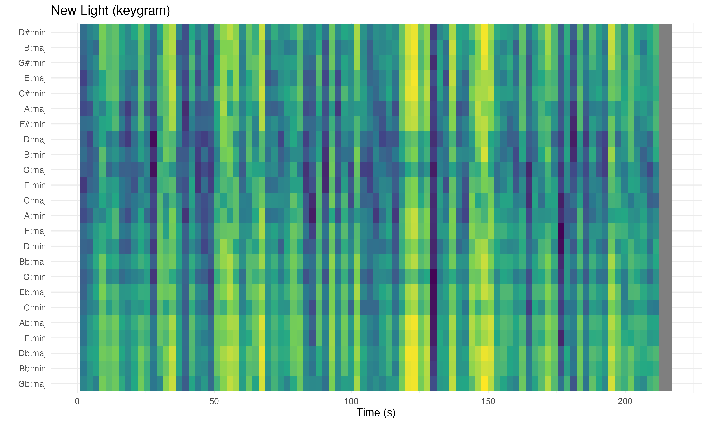{width=100%}
{width=100%}
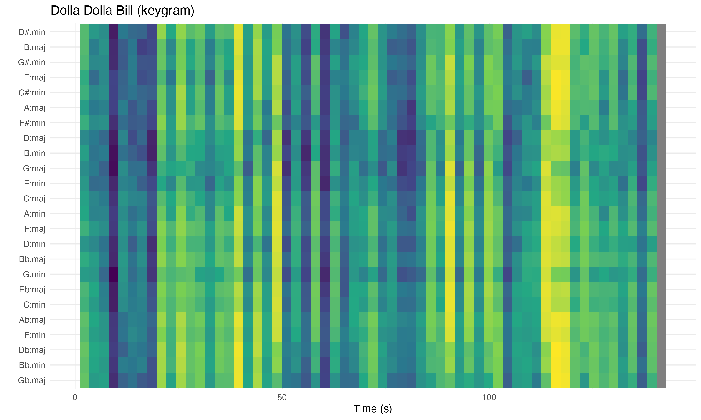{width=100%}
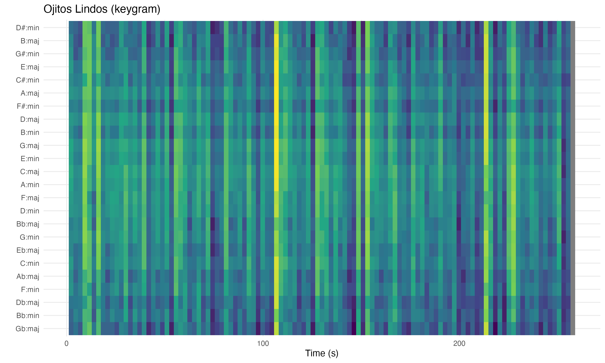{width=100%}
These keygrams add a useful middle layer between the yearly key heatmap and the chromagrams, because they show which local keys become more plausible over time rather than reducing a whole song to one global label. In New Light, the brightness is spread across a broader field of related keys, especially around G major, E minor, C major, and D major, with no single row dominating for very long. That fits the chromagram, where pitch activity was distributed across several classes, and the self-similarity matrix, which looked more continuous than strongly block-based. By contrast, Dolla Dolla Bill looks more concentrated: the keygram repeatedly returns to a narrower tonal region around B major / G# minor and their close relatives such as E major and C# minor. This supports the earlier heatmap reading of 2021 as a B-centred song, while the chromagram and self-similarity matrix suggest that this tonal focus is paired with a more repetitive sectional design.

Ojitos Lindos sits between these two cases. Its keygram does not stay fixed on one single row, but it repeatedly gravitates toward a related group of keys around Eb major / C minor, with nearby emphasis also touching Ab major and Bb minor. That matches the yearly heatmap, where the song’s global key was highlighted around D#/Eb, and also fits the chromagram, which showed a tightly focused pitch-class collection rather than a broad harmonic field. Taken together, the heatmap, chromagrams, keygrams, and self-similarity matrices suggest that my listening history is shaped not only by recurring tonal centres such as G, B, and Eb/D#, but also by different degrees of tonal stability inside songs: New Light is more fluid, Dolla Dolla Bill is more tightly centred and repetitive, and Ojitos Lindos is tonally focused without being as rigidly patterned.
:::

# Loudness and timbre

## Column {width=35%}

::: {.card}
### Loudness in the corpus

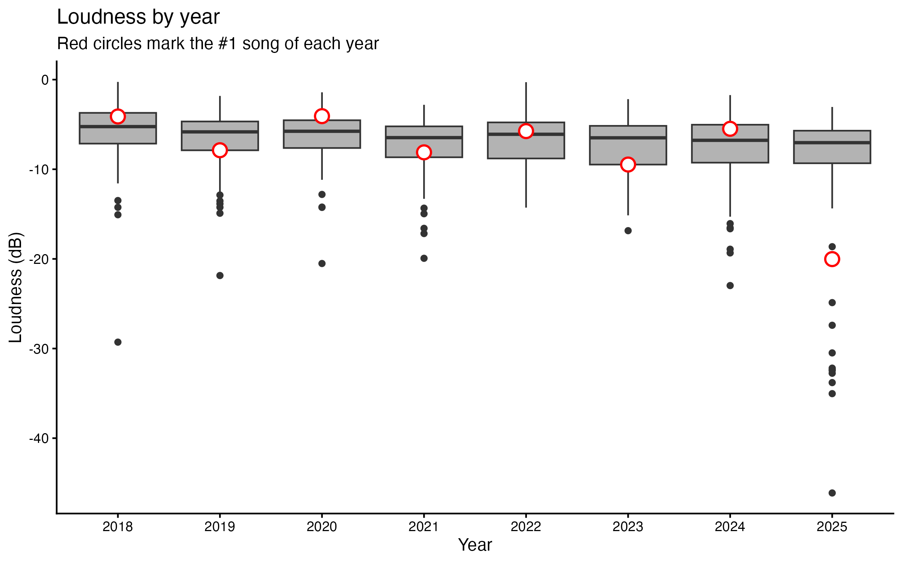{width=100%}

This plot suggests that the loudness of my preferred songs was mostly stable over time, since the yearly medians remain in a fairly narrow range and the distributions overlap strongly from 2018 to 2024. That means there is little evidence of a steady shift toward either consistently louder or consistently softer listening across most of the dataset. The main differences instead appear in the spread of the yearly distributions and in the position of the #1 songs. In most years, the favourite track sits close to the centre of that year’s loudness range, but 2025 stands out: its #1 song is much quieter than the yearly core and the year also contains more very quiet outliers. Overall, the figure suggests that loudness was a relatively stable part of my listening profile, while recent years — especially 2025 — may indicate greater openness to softer tracks.

A further point is that this graph distinguishes loudness level from musical intensity more broadly. A track can have a relatively moderate average loudness and still feel powerful because of its arrangement, spectral density, or the way energy is distributed across sections. For that reason, the plot is most useful for showing whether my preferred songs occupy a similar overall loudness range, not for proving that some years were emotionally or sonically “stronger” than others. Read cautiously, the main takeaway is that my listening habits stayed anchored in a fairly consistent loudness profile, while a few quieter favourites, especially in 2025, suggest that this preference became slightly more flexible rather than being replaced altogether.
:::

## Column {width=65%}

::: {.panel-tabset .card}

## Cepstrograms
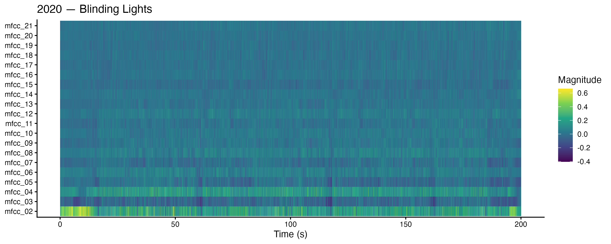{width=100%}
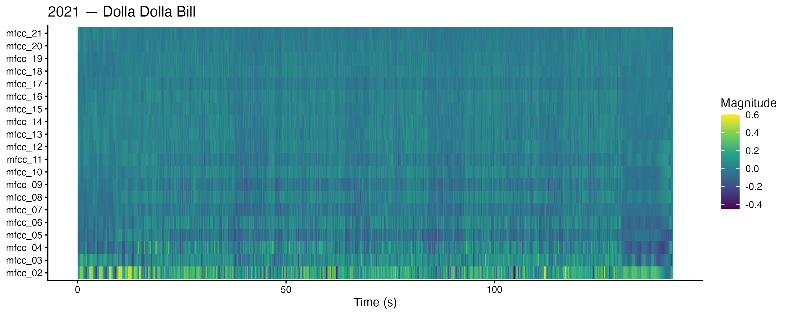{width=100%}
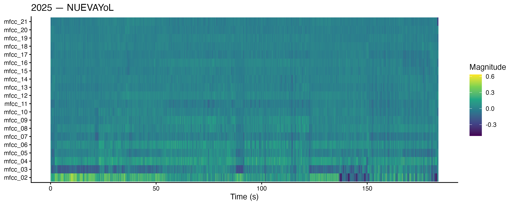{width=100%}
These MFCC heatmaps compare the **timbral profile** of three yearly favourites by showing how the cepstral coefficients change over time. In this kind of representation, the most informative patterns are usually in the **lower-order coefficients** near the bottom of the plot, because they summarize the rough shape of the spectral envelope, while the higher coefficients often capture finer detail and tend to look more stable or less visually prominent. That is also what appears here: all three songs are dominated by activity in the lower rows, but they differ in how **stable, striped, or contrastive** those rows are over time. *Blinding Lights* looks the most even and smoothed, with relatively persistent horizontal bands and fewer abrupt timbral disruptions; *Dolla Dolla Bill* shows stronger local fluctuation, especially in the lower coefficients, with more visible vertical striping and sectional contrast; and *NUEVAYoL* appears comparatively restrained for much of the track, but with a more noticeable timbral shift in the later middle section, where the lower coefficients darken and the spectral envelope seems to change more clearly. Read together, the three plots suggest not just different songs, but different ways of organizing timbre: **stable and polished** in *Blinding Lights*, **more contrastive and segmented** in *Dolla Dolla Bill*, and **generally softer or more muted with a marked internal change** in *NUEVAYoL*. MFCCs are commonly used this way because they correlate with aspects of timbre and are well suited to distinguishing sections with different instrumentation or texture.  

Comparing these timbre plots with the **loudness-by-year** graph makes the contrast even more useful. The loudness plot showed that **2020** sits near the louder end of your yearly favourites, **2021** is somewhat quieter but still close to its year’s central range, and **2025** is the strongest low-loudness outlier, with a much quieter #1 song than the earlier yearly winners. The MFCC plots partly support that story, but not in a simple one-to-one way. *NUEVAYoL*’s quieter loudness is consistent with a timbral profile that looks less aggressively contrastive overall, especially compared with the brighter, denser lower-coefficient activity in *Blinding Lights*. At the same time, *Dolla Dolla Bill* shows that a track can be less loud on average yet still have a timbral pattern that is quite active and sectionally differentiated. That matters analytically because it suggests that **average loudness and timbral organization are related but not identical dimensions** of taste: the loudness graph points to a recent openness to quieter tracks, while the MFCC plots show that this quieter preference does not necessarily mean flatter or simpler sonic design. A careful conclusion, then, is that your listening history appears fairly stable in general intensity, but the three examples reveal meaningful variation in **how sonic colour is shaped over time**, from polished continuity to stronger sectional contrast to quieter, more subdued timbral space. MFCCs are useful for this comparison, but they remain feature representations rather than direct perceptual truth, so they are best read as evidence of changing **spectral texture** rather than as a complete description of what the songs “sound like.”   

## Timbre self-similarity
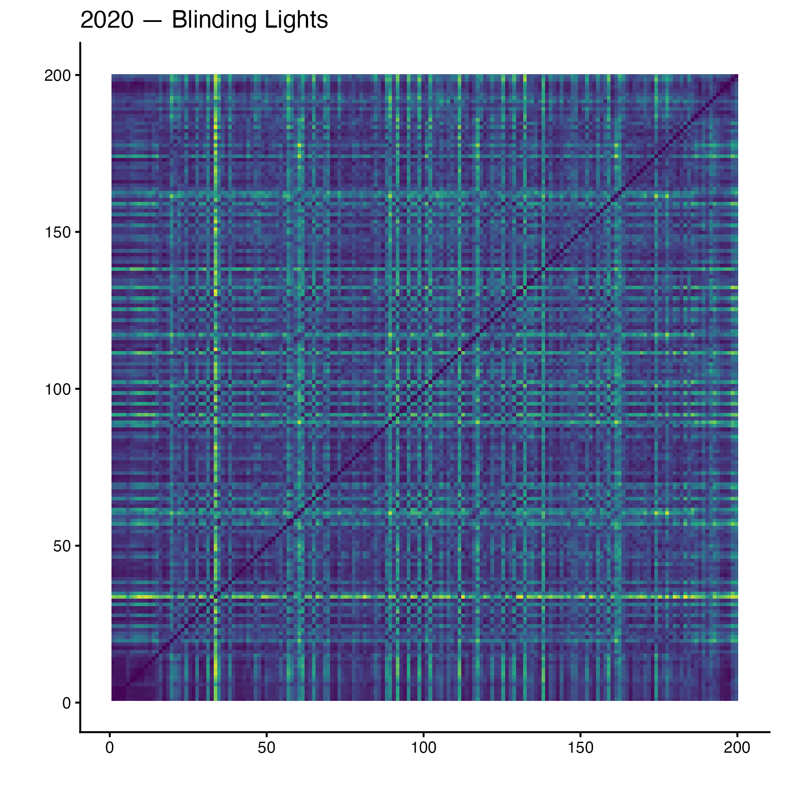{width=100%}
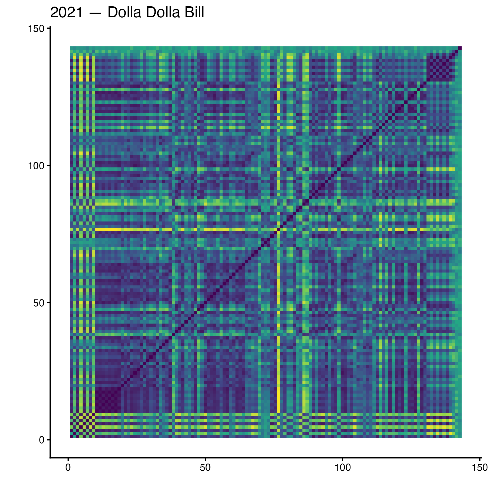{width=100%}
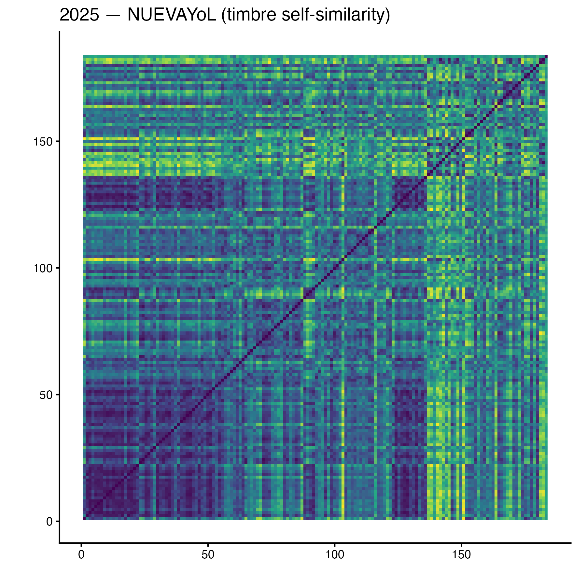{width=100%}

Yes — here is a more dashboard-friendly version:

These **timbre self-similarity matrices** show how each song reuses its sonic texture over time. The most important patterns are the off-diagonal blocks and stripes: when these recur clearly, they suggest repeated timbral sections or returns of similar instrumentation and spectral colour. **Blinding Lights** shows the most regular and grid-like pattern, which suggests a highly controlled and repetitive timbral design. **Dolla Dolla Bill** is also strongly repetitive, but with sharper internal contrasts between sections. **NUEVAYoL** looks less rigidly patterned, with repeated timbral relations that are weaker and more uneven, especially around the later middle of the track. This suggests a structure that is still organized, but less tightly looped than the other two examples.

Compared with the earlier **MFCC heatmaps** and the **loudness plot**, these matrices show that average loudness and timbral form are related but not identical. **Blinding Lights** combines relatively high loudness with very regular timbral repetition, while **Dolla Dolla Bill** remains strongly sectioned even without being the loudest of the three. **NUEVAYoL**, which was also the quietest outlier in the loudness analysis, shows a less repetitive and more flexible timbral structure. Taken together, the three songs suggest that my favourites differ not only in how loud they are, but also in how consistently they repeat their sonic colour over time.

:::

# Temporal features [duration]

## Column {width=40%}

::: {.card}
### Corpus-level temporal structure

{width=100%}

{width=100%}

These temporal-feature plots suggest that my listening history was highly stable in metre but somewhat more flexible in song length. The time-signature chart is dominated almost entirely by 4/4 in every year, and all yearly #1 songs also fall into that metre. This means there is little evidence that my taste changed through shifts in basic pulse organization: even when other musical features varied, my favourites remained rooted in the standard quadruple metre that characterizes much popular music.

Track duration shows slightly more variation. Most yearly distributions stay centred around the familiar 3–4 minute range, which suggests another broad continuity in my listening habits, but some later years include more long-duration outliers. The yearly #1 songs usually sit near the middle of their distributions, although 2021 is relatively short, 2022 somewhat longer, and 2025 falls below the centre of a year that otherwise contains several extended tracks. Overall, these graphs suggest that my temporal preferences were more stable in metre than in length: the pulse framework stayed consistent, while the amount of time a song occupied became a little more flexible.
:::

## Column {width=60%}

::: {.panel-tabset .card}

## Novelty
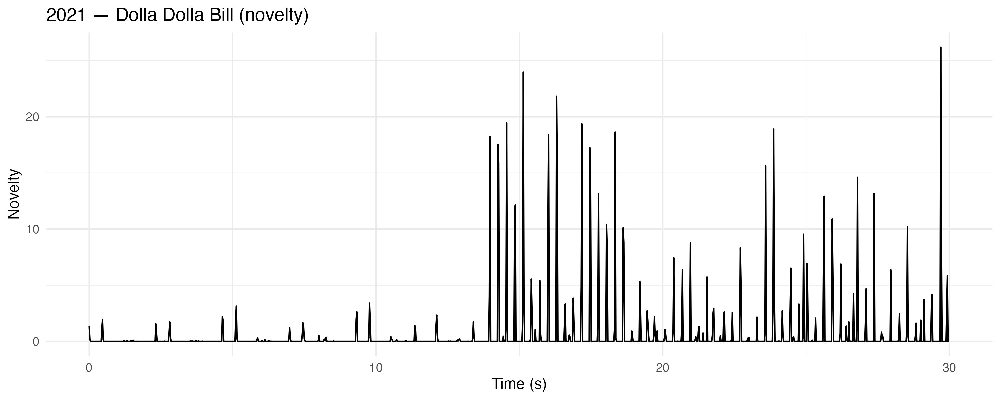{width=100%}

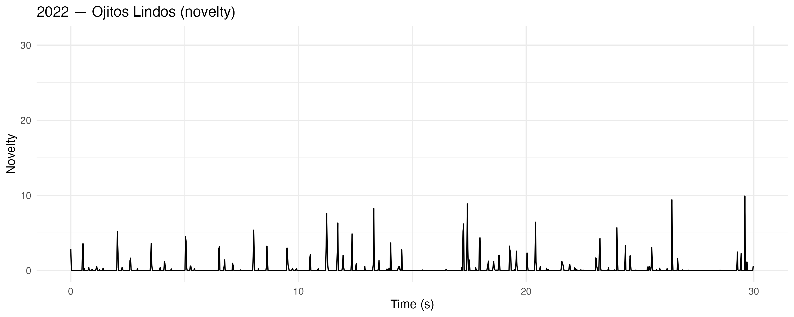{width=100%}

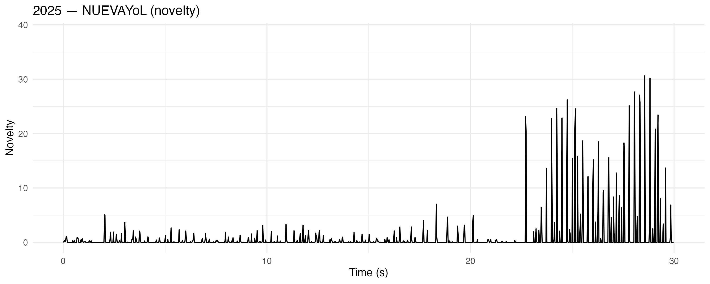{width=100%}
These novelty curves add a finer-grained temporal view to the earlier time-signature and duration plots. A novelty function highlights moments of local change, so the main thing to look for is where peaks occur, how tall they are, and whether they are evenly spread or clustered. In Dolla Dolla Bill, the first half of the excerpt is relatively quiet, but after roughly 14 seconds the curve becomes much denser and more jagged, with many high peaks. That suggests a passage with more frequent onsets or sharper local changes. Ojitos Lindos looks more even and restrained: the peaks are generally lower, more dispersed, and less dramatically clustered, which suggests a smoother local rhythmic flow. NUEVAYoL is the most contrastive of the three, because it stays fairly low for most of the excerpt and then produces a strong burst of large peaks in the final third, especially after about 23–24 seconds. Read musically, these three excerpts do not mainly differ in metre, but in how change and accent density are distributed over time. Novelty curves are useful for this because they capture local transitions and can support segmentation or tempo-related analysis even when the metre itself remains constant.

This matters for the broader temporal story because the earlier plots showed that my listening is overwhelmingly rooted in 4/4 and only moderately variable in total duration. These novelty curves show what those track-level summaries cannot: songs can share the same metre and sit in a similar overall duration range, yet still differ a great deal in sectional pacing and local rhythmic energy. In that sense, the novelty analysis refines the temporal-feature section: the stability of 4/4 suggests continuity in basic pulse organization, but the different peak patterns in these excerpts show that my favourites vary in how strongly they articulate change within that framework. Ojitos Lindos suggests a steadier and less abrupt temporal profile, while Dolla Dolla Bill and especially NUEVAYoL create stronger local contrast through clustered bursts of novelty. The safest conclusion, then, is that my taste stayed stable at the level of metre, somewhat flexible at the level of length, and more varied at the level of moment-to-moment temporal articulation and sectional contrast.

## Tempograms

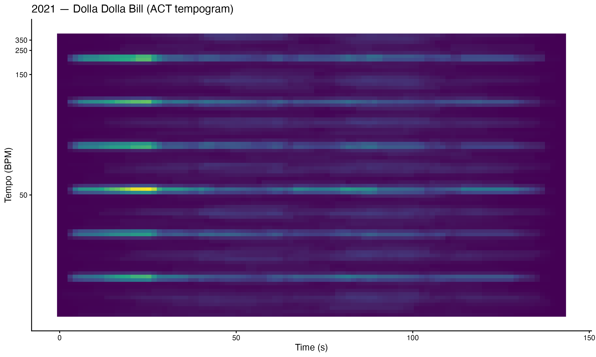{width=100%}
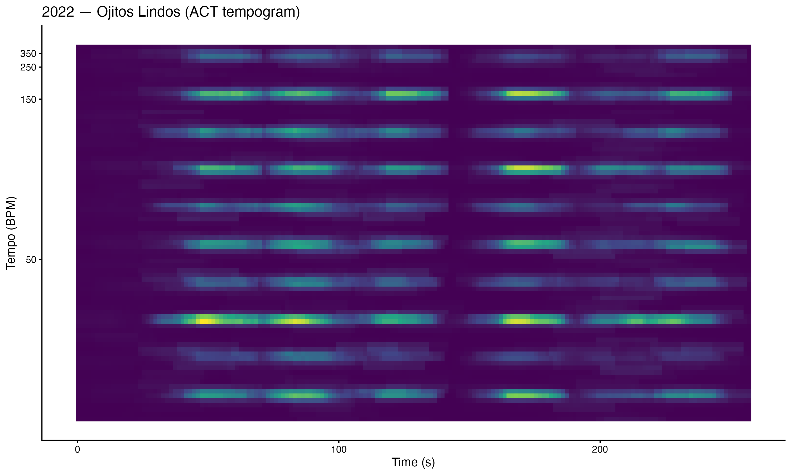{width=100%}

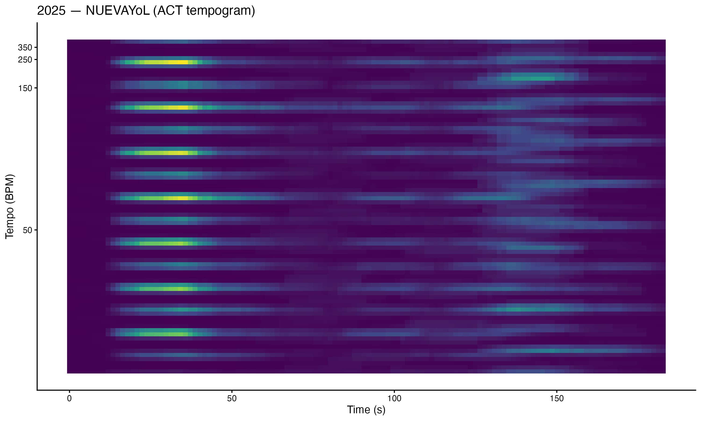{width=100%}

These **ACT tempograms** refine the earlier temporal analysis by showing how strongly different **local pulse rates** are supported over time. In a tempogram, brighter horizontal bands indicate a stronger locally periodic pulse at that BPM, but these bands should not be read as one exact “true tempo” only: pulse is hierarchical, so related levels such as tactus, measure, and faster subdivisions can all appear at once. Autocorrelation-based tempograms are especially useful here because they capture local periodic self-similarities in the novelty curve and often highlight slower pulse levels as well as the main beat.    In **Dolla Dolla Bill**, the most visible bands stay relatively stable across the full track, especially around a slower pulse region near **55 BPM** and its related higher levels, which suggests a fairly consistent periodic framework even when the novelty curve becomes much denser after about 14 seconds. **Ojitos Lindos** looks more segmented: the stronger tempo bands appear in clearer blocks, with repeated local emphasis around the same pulse region but more obvious sectional interruptions. **NUEVAYoL** shows the greatest late change: the tempogram becomes more active and redistributed in the later portion of the song, which matches the novelty curve’s strong burst of peaks after roughly **23–24 seconds**. Read together, the tempograms suggest that these tracks do not mainly differ in basic metre, but in **how steadily or flexibly they sustain local pulse energy over time**.  

This fits well with the earlier **time-signature** and **duration** plots. Those graphs showed that my listening history is overwhelmingly rooted in **4/4** and usually stays within a familiar **3–4 minute** song-length range, so the broad temporal framework of my preferences is quite stable. The tempograms and novelty curves add the detail that those track-level summaries cannot show: songs can share the same metre and similar duration, yet still differ substantially in **sectional pacing, pulse salience, and local rhythmic articulation**. In that sense, **Dolla Dolla Bill** combines a stable pulse framework with more abrupt local change, **Ojitos Lindos** combines stable metre with smoother and more sectionally patterned pulse organization, and **NUEVAYoL** keeps the same broad temporal framework but introduces much stronger late contrast in both novelty and tempo-related energy. The strongest overall conclusion is therefore that my temporal taste was **stable at the level of metre**, somewhat flexible in **length**, and most variable in the **internal organization of pulse and change over time**.   

:::

# Clustering

## Column {width=50%}

::: {.card}
### Hierarchical clustering

{width=100%}

This dendrogram suggests that my top songs form overlapping groups rather than sharply separated yearly phases. Songs from different years are mixed throughout the tree, and many tracks from early and later years cluster together at relatively low heights. This means that my listening history is more continuous than abrupt in the feature space used here: even when individual yearly favourites differ, the broader set of songs keeps returning to similar combinations of musical properties. In that sense, the clustering supports the argument from the earlier plots that my taste changed gradually and selectively, not through complete stylistic breaks.

At the same time, the dendrogram also shows that my listening was not completely uniform. Some songs join very early, which suggests especially close similarity, while a few tracks connect to the rest only at higher levels, meaning they are more distinctive within the corpus. So the main value of this figure is not that it reveals fixed “types” of songs, but that it shows a balance between stable preference patterns and a small number of outliers or exceptions. For this project, that makes the clustering useful evidence that my listening history contains recognizable recurring feature profiles, while still leaving room for standout tracks that sit further away from my usual musical centre.
:::

## Column {width=50%}

::: {.card}
### Cluster distribution and interpretation

<iframe 
  src="Images/All top songs/Week 12/week12_cluster_heatmap_top10_per_year.html" 
  width="100%" 
  height="900" 
  style="border:none;">
</iframe>

This clustered heatmap should be read in two directions at once. Each row is a song and each column is one track-level feature: acousticness, instrumentalness, tempo, duration, valence, danceability, speechiness, liveness, energy, and loudness. The colours show whether a song is above or below the overall average for each feature, with brighter cells meaning relatively higher values and darker cells meaning relatively lower values. The dendrogram on the side groups songs that have similar feature profiles, so songs placed next to each other are more alike across the full set of variables, not just in one column. The thin coloured strip next to the rows marks the year, which is useful for checking whether songs from the same year cluster together or whether songs from different years mix.

What is most noticeable is that the rows are not organized into clear year blocks. Songs from different years appear throughout the same clusters, which suggests that my listening history returns to similar feature combinations across time rather than splitting into sharply separate phases. A good example is the top part of the heatmap, where NUEVAYoL and The Lamp Is Low cluster together because they are relatively quiet, low-energy, and more instrumental/acoustic than much of the rest of the corpus. Other clusters contain songs with stronger danceability or more positive valence, showing that my taste contains several recurring feature profiles rather than one single type of song. So the important thing to notice is not just which songs are neighbours, but which columns are bright or dark within each cluster, because that reveals what kind of musical profile each group represents.
:::

# Contribution

::: {.card}
### What this analysis shows

Across the full corpus, my top songs are not randomly distributed across musical feature space. Instead, they repeatedly return to a limited set of feature combinations, especially in terms of energy, danceability, tempo, and tonal organisation.

At the same time, the analyses suggest that these preferences do not remain completely fixed. Some features remain quite stable across the years, while others shift more clearly. In particular, pitch, timbre, and temporal analyses suggest gradual changes in the character of my preferred songs rather than a complete break between early and later listening habits.

Taken together, the results suggest that my music taste changed over time, but in a gradual way. The strongest pattern is not total replacement of one style by another, but a rebalancing of existing preferences: some core tendencies remain, while the relative importance of mood, texture, tonal emphasis, and rhythmic structure changes across years.

This type of analysis could be useful for anyone interested in computational musicology as a way of describing personal listening history, especially when combining corpus-level summaries with close reading of selected tracks.
:::