# Background and dataset

## Column {width=45%}

::: {.card}
### Project overview

This dashboard presents a computational musicological analysis of my own top songs from **2018 to 2025**, using a merged corpus based on my yearly **“Your Top Songs”** playlists. The aim is to understand both recurring preferences and long-term changes in my listening history.

The project is guided by three research questions:

1. What are the most common musical features across my top songs?  
2. How do these features evolve over time in my listening habits?  
3. Did my tastes change over the years, and if so, how?  

The merged corpus is used for broad comparisons across years, while selected tracks are used for more detailed pitch, timbre, harmonic, and temporal analyses. Together, these different levels of analysis make it possible to compare overall listening patterns with close musical detail.
:::

## Column {width=55%}

::: {.card}
### Corpus overview

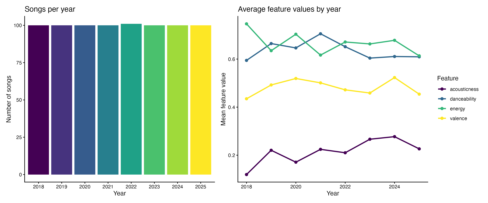{width=100%}

This corpus overview shows that the dataset is evenly distributed across the years **2018–2025**, which makes year-by-year comparisons more reliable. The feature trends suggest both continuity and change in my listening habits. **Danceability** remains consistently high across the whole period, and **energy** also stays relatively high, which suggests that rhythmically engaging and intense tracks are a stable part of my taste. By contrast, **acousticness** rises over time, especially in the later years, which may indicate a gradual shift toward more acoustic or less densely produced music. **Valence** fluctuates more than the other features, suggesting that the emotional tone of my favorite songs changes from year to year rather than moving in a single direction.
:::

# Track-level features

## Column {width=50%}

::: {.card}
### Tempo and valence across years

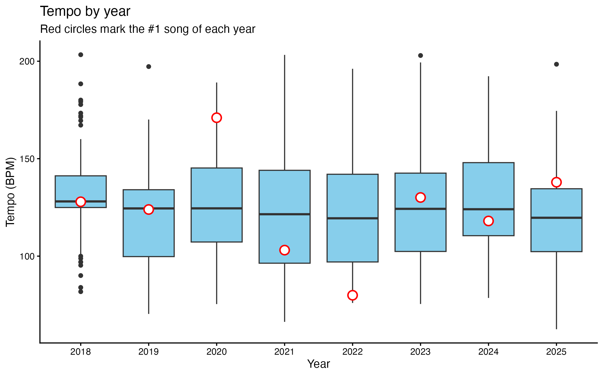{width=100%}

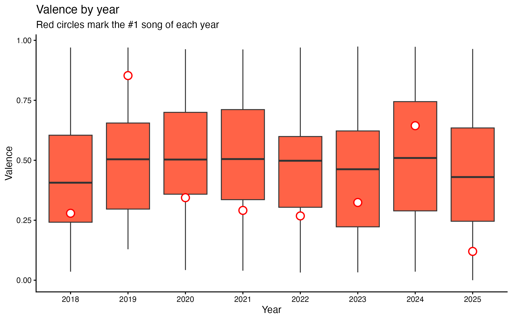{width=100%}

These plots show that my listening habits were more stable in tempo than in valence. Across years, tempo medians remain concentrated in a similar moderate-to-fast range and the yearly distributions overlap strongly, suggesting continuity in the basic pulse or pacing of the songs I preferred. Valence, however, varies more from year to year, especially in the yearly #1 tracks, which indicates that the emotional colouring of my favourites shifted more than their rhythmic drive. Following the course material, this should be interpreted cautiously: tempo and valence are useful track-level summaries, but they capture only part of the music. Even so, the overall pattern suggests a relatively stable preference for a similar rhythmic zone, combined with greater flexibility in mood or affective tone.
:::

## Column {width=50%}

::: {.card}
### Energy, danceability, and overall feature space

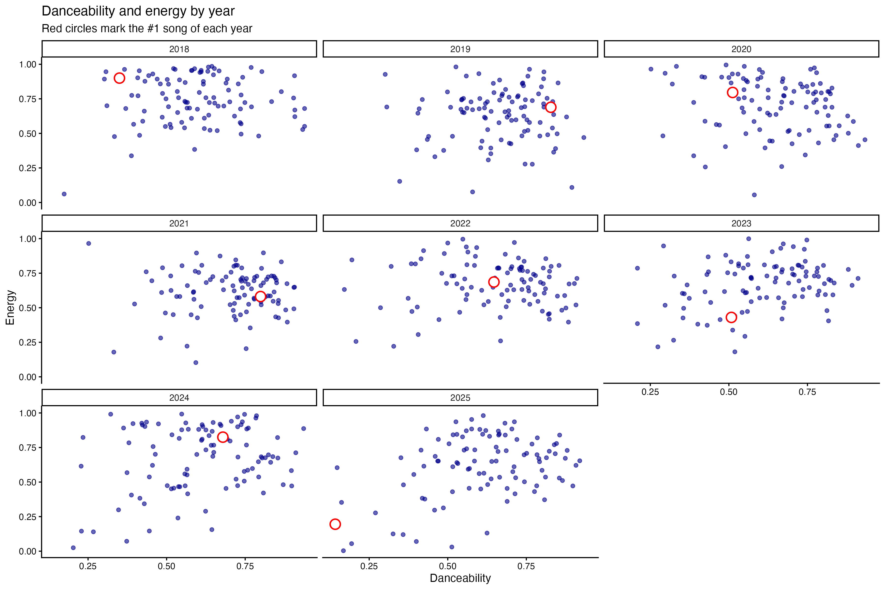{width=100%}

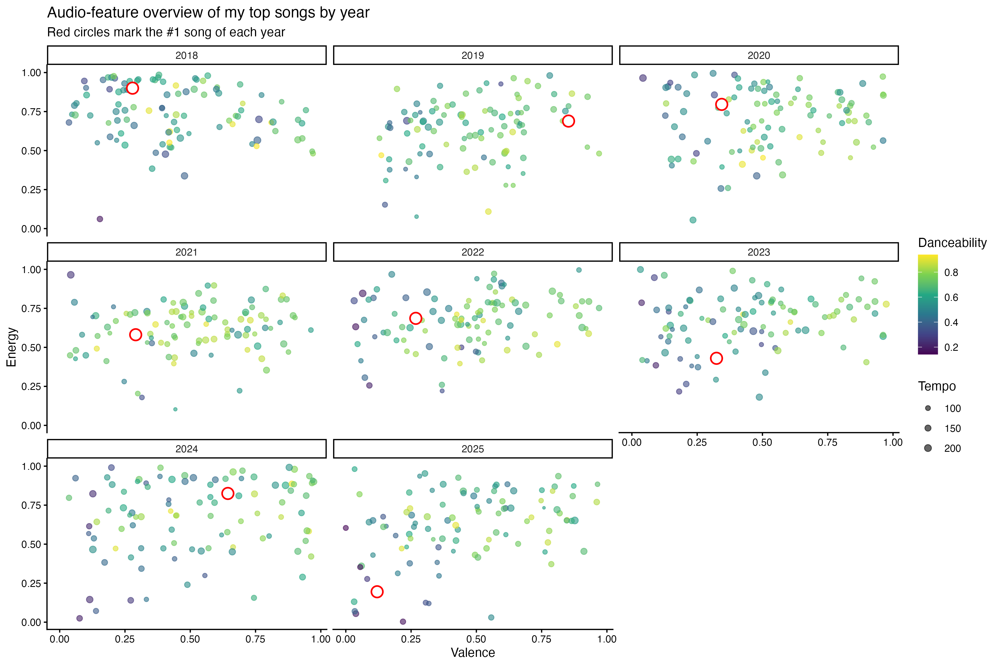{width=100%}

These figures position my top songs within a track-level feature space and suggest that my listening taste is more stable than volatile. Across most years, the songs cluster in a broadly similar region characterised by moderate-to-high energy and danceability, while valence varies more widely. This suggests a recurring preference for tracks with rhythmic drive and momentum, even when their affective character differs. The overlap between yearly clouds indicates that changes in taste were mostly gradual rather than abrupt. Where differences do appear, they are better understood as shifts in emphasis within a stable preference profile than as a complete stylistic break. The yearly #1 songs sometimes sit away from the centre of each cloud, which shows that standout favourites can be more exceptional than representative of my overall listening in that year.
:::

# Chroma features [pitch]

## Column {width=40%}

::: {.card}
### Pitch overview across the corpus

{width=100%}

This heatmap shows that my listening history contains some recurring tonal centres, rather than a completely different key profile every year. C# appears especially prominent across several years, while other years distribute more evenly across neighbouring keys, suggesting continuity with variation rather than a single fixed harmonic preference. The yearly #1 songs often fall outside the most common key of the year, which indicates that standout favourites were not always tonally typical of my broader listening. This should be interpreted cautiously: key is a useful harmonic summary derived from chroma or pitch-class information, but it compresses musical detail and may hide local modulations or modal differences. Overall, the plot suggests that my taste shows some stable tonal tendencies, but these coexist with enough yearly variation that the evidence supports recurrence rather than strict tonal uniformity.

I chose three individual songs for closer chroma and self-similarity analysis because they represent different tonal centres rather than the same recurring key repeated three times. This makes them useful comparison cases: instead of only confirming that one key dominates my listening, they let me test whether songs in different keys still share broader harmonic tendencies or structural similarities. In that sense, the close readings complement the yearly heatmap by asking not just which keys recur in my listening history, but also how differently keyed songs organize and reuse pitch material over time.

:::

## Column {width=60%}

::: {.panel-tabset .card}

## Chromagrams
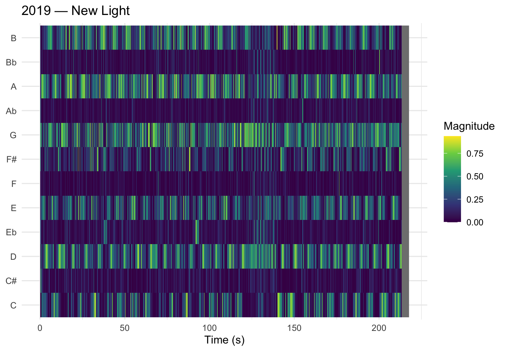{width=100%}
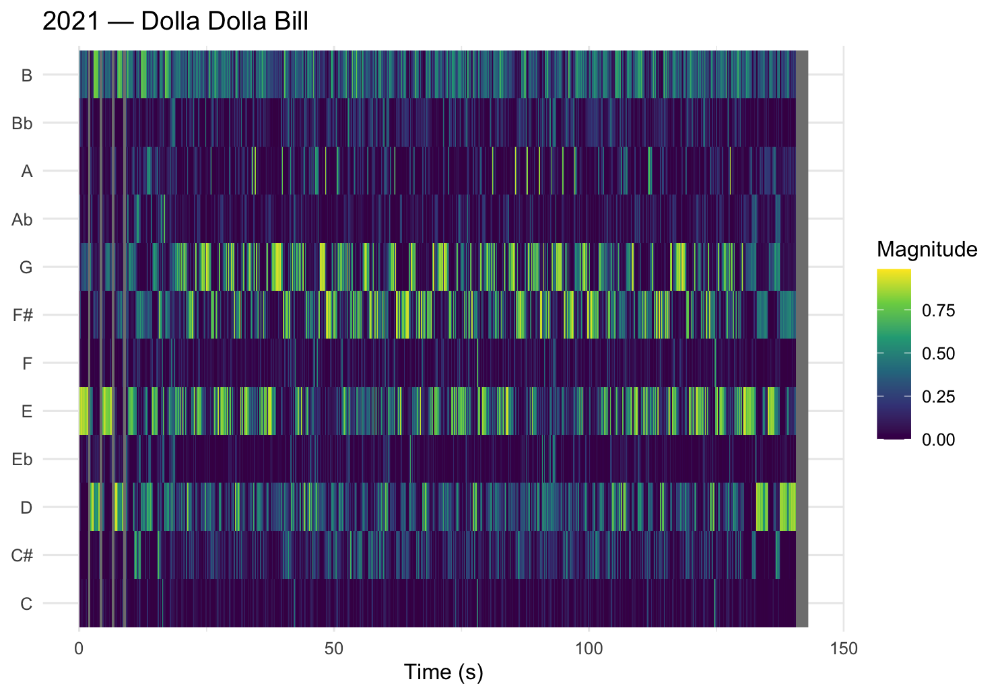{width=100%}
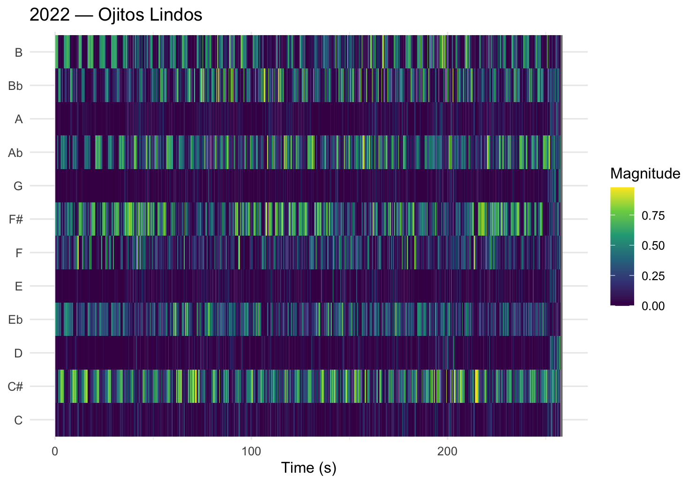{width=100%}
These chromagrams deepen the earlier key-heatmap analysis by showing how pitch-class activity unfolds over time inside individual songs, rather than only summarizing each track with one global key label. The rows correspond to the twelve pitch classes, and brighter yellow-green bands indicate stronger activity in that pitch class at a given moment. In other words, the reader should look for which horizontal rows stay bright for long stretches and which combinations recur across the track. In New Light, activity is spread across several rows rather than being tightly concentrated in only a few; the most consistently active regions appear around A, G, E, D, and C, which makes the tonal field look relatively broad and fluid. In Dolla Dolla Bill, the brighter bands are concentrated more strongly around a smaller set of pitch classes, especially B, E, G, F#, and D, so the tonal space appears tighter and more repetitive. In Ojitos Lindos, the strongest emphasis is even more focused: the reader can look especially at C#, F#, Ab, Eb, and Bb, whose repeated brightness creates the clearest sense of a stable harmonic centre. This is why Ojitos Lindos aligns most clearly with its global key estimate in the earlier yearly heatmap.

Taken together, these examples suggest that my listening history is shaped not only by recurring tonal centres across years, but also by different degrees of harmonic concentration and stability within songs. The earlier key heatmap identified broad yearly tendencies — for example, recurring prominence of certain tonal centres such as C#, and highlighted the #1 songs in G (2019), B (2021), and D#/Eb (2022). The chromagrams add detail by showing how those centres are actually distributed over time inside each song. Two tracks may both be associated with a clear tonal centre, but one may spread its activity across a wider pitch-class collection while another returns more insistently to a limited set of rows. That means the important thing to notice is not only the single “key” attached to a song, but also whether the graph shows a broad field of recurring pitch classes or a narrower and more persistent concentration. At the same time, chromagrams are still feature representations rather than exact harmonic transcriptions, so these patterns should be read as tonal tendencies rather than definitive proof of exact chords or modulations.

## Pitch self-similarity

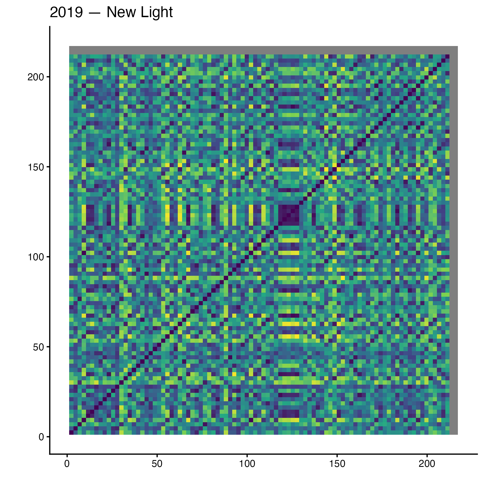{width=100%}

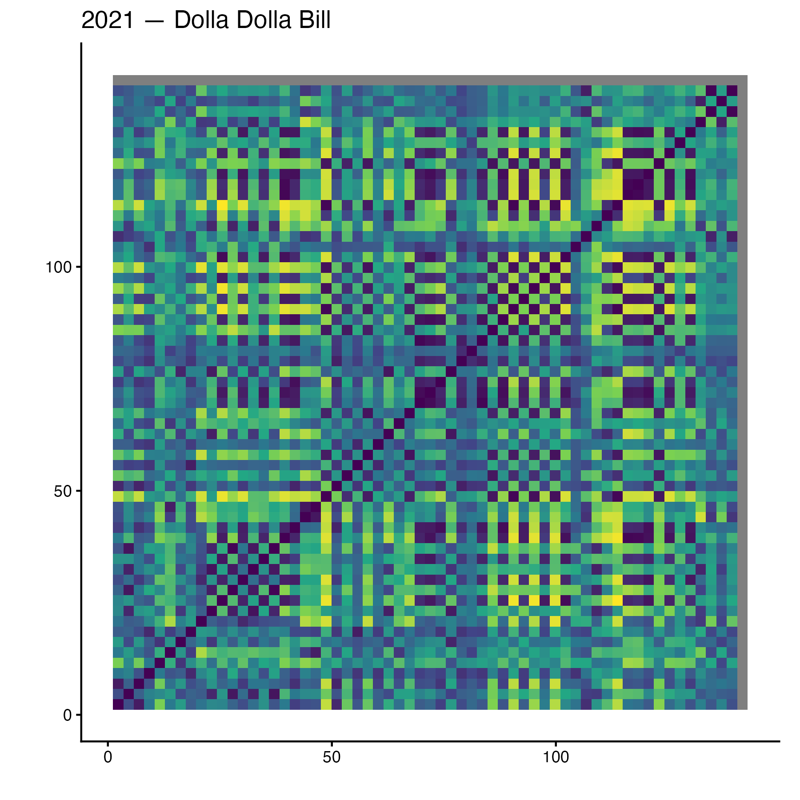{width=100%}

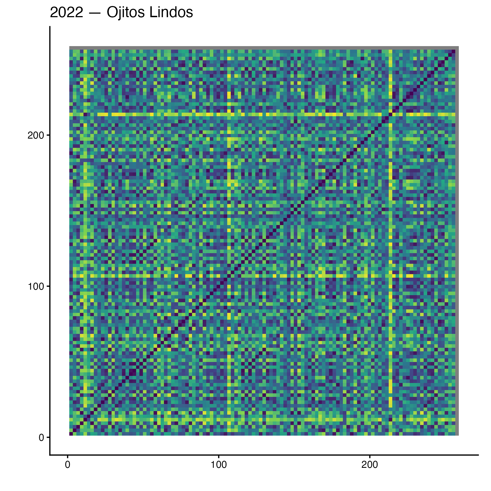{width=100%}
These pitch self-similarity matrices extend the earlier chromagram and key-based analyses by showing how harmonic material is reused over time within individual songs. Both axes represent time, so each point compares one moment in the song with another. The dark main diagonal from top left to bottom right is expected, because every moment is always maximally similar to itself. The most important places to look are therefore the off-diagonal shapes: when darker paths or blocks appear away from the main diagonal, they suggest that similar pitch material returns at different times. In line with the course material, repeated sections often appear as lines parallel to the main diagonal, while more internally stable or homogeneous sections appear as block-like regions.

Among the three examples, Dolla Dolla Bill shows the clearest repeated sectional structure. The reader can see this most easily in the more visible dark off-diagonal bands and rectangular regions, especially through the middle and later portions of the matrix, which indicate that similar pitch configurations return in multiple places. New Light looks more diffuse: there are still repeated relations, but they are weaker and less cleanly segmented, so the eye catches fewer strong off-diagonal paths and fewer sharply bounded blocks. This makes its form look more continuous and less loop-like. Ojitos Lindos sits between these extremes. It still shows noticeable repeated relations, but they are less rigidly patterned than in Dolla Dolla Bill; the reader should look for broader areas of similarity and partial returns rather than expecting a strongly gridded pattern. Together, these differences suggest that the songs do not simply vary in tonal centre, but also in how clearly and regularly pitch material is repeated across sections.

Taken together, the matrices add a structural perspective to the earlier key and chroma plots. The key heatmap showed broad yearly tonal tendencies, and the chromagrams showed which pitch classes remain active over time; the self-similarity matrices go one step further by showing whether that pitch material is reused in recurring formal units. The reader should therefore compare not just which song has the strongest tonal focus, but also which graph has the clearest off-diagonal returns, since those are the best visual clues for repetition and sectional recurrence. At the same time, these matrices are still feature-based representations rather than direct ground truth about form, so blurred or weak patterns do not mean that repetition is absent altogether; they may also reflect variation in voicing, texture, timing, or harmonic detail between repeated sections.

## Key and chord analysis
Place your selected keygrams and chordograms here.

These figures provide a more detailed pitch-based view of the corpus by showing how pitch-class emphasis, repetition, and harmonic organization operate within selected tracks.

:::

# Loudness and timbre

## Column {width=35%}

::: {.card}
### Loudness in the corpus

Place your loudness-by-year plot here.

This plot shows whether my preferred songs became louder, softer, or more variable in average intensity over time.
:::

## Column {width=65%}

::: {.panel-tabset .card}

## Cepstrograms
Place your selected cepstrograms here.

## Timbre self-similarity
Place your selected timbre self-similarity matrices here.

These figures show how sonic texture changes within tracks and whether repeated sections share similar timbral profiles. Together, they help distinguish smoother, more homogeneous tracks from tracks with sharper internal contrasts.
:::

# Temporal features [duration]

## Column {width=40%}

::: {.card}
### Corpus-level temporal structure

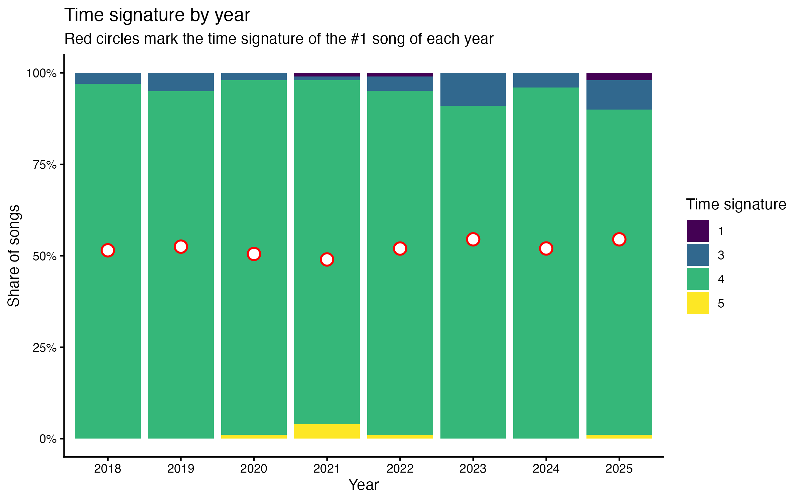{width=100%}

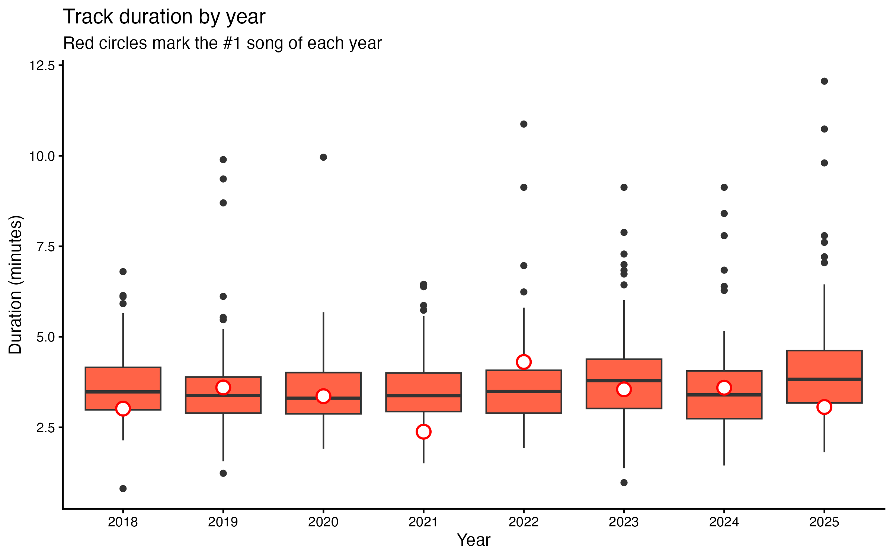{width=100%}

These plots show whether my listening remains metrically stable, and whether track lengths become shorter, longer, or more variable over time.
:::

## Column {width=60%}

::: {.panel-tabset .card}

## Novelty
Place your selected novelty curves here.

## Tempograms
Place your selected ACT tempograms here.

These plots show where strong musical changes occur and how clearly beat structure emerges over time in selected tracks.
:::

# Clustering

## Column {width=50%}

::: {.card}
### Hierarchical clustering

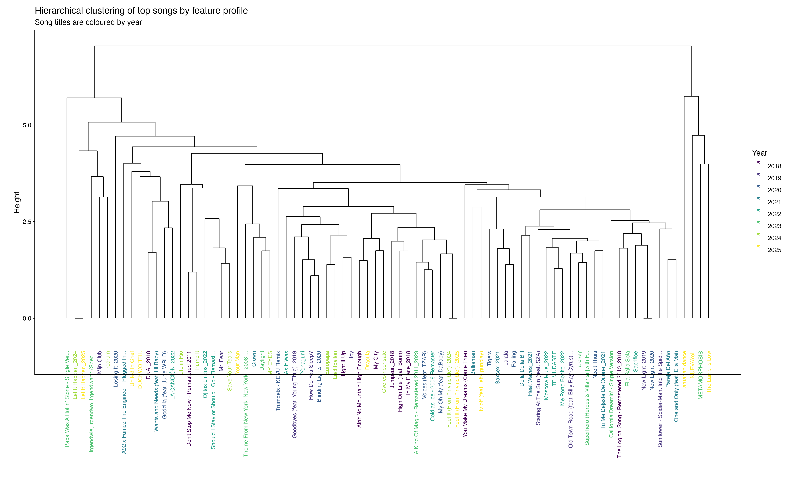{width=100%}

The dendrogram shows whether the corpus forms a few recurring groups of songs rather than one homogeneous collection. Colouring the song labels by year helps reveal whether certain listening periods cluster together.
:::

## Column {width=50%}

::: {.card}
### Cluster distribution and interpretation

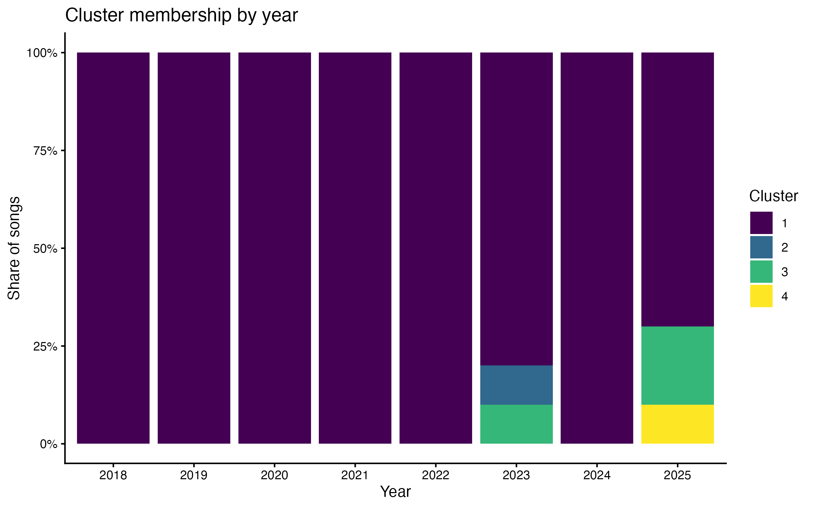{width=100%}

{width=100%}

These plots show how the balance of clusters changes by year and which features distinguish those clusters. This helps identify recurring listening types and whether their relative importance shifts over time.
:::

# Contribution

::: {.card}
### What this analysis shows

Across the full corpus, my top songs are not randomly distributed across musical feature space. Instead, they repeatedly return to a limited set of feature combinations, especially in terms of energy, danceability, tempo, and tonal organisation.

At the same time, the analyses suggest that these preferences do not remain completely fixed. Some features remain quite stable across the years, while others shift more clearly. In particular, pitch, timbre, and temporal analyses suggest gradual changes in the character of my preferred songs rather than a complete break between early and later listening habits.

Taken together, the results suggest that my music taste changed over time, but in a gradual way. The strongest pattern is not total replacement of one style by another, but a rebalancing of existing preferences: some core tendencies remain, while the relative importance of mood, texture, tonal emphasis, and rhythmic structure changes across years.

This type of analysis could be useful for anyone interested in computational musicology as a way of describing personal listening history, especially when combining corpus-level summaries with close reading of selected tracks.
:::